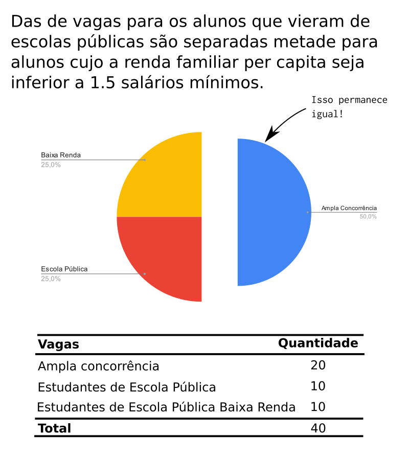

= Como escolher um curso de computação
:toc: left
:toclevels: 1
:language: asciidoc
:docref: link:/docs

Este é um F.A.Q. que tem como objetivo ajudá-lo a escolher um curso na área de desenvolvimento de software. É importante destacar que muitas pessoas, estão buscando formação acadêmica e profissional para alcançar seus objetivos pessoais e profissionais. Este é um caminho positivo e que pode trazer muitas oportunidades e realizações. O F.A.Q. busca fornecer informações valiosas para ajudá-lo a tomar uma decisão informada sobre sua formação na área de software.

Todo colaboração é bem vinda, por isso dê sugestões, revise o texto, adicione questões. Esse é um trabalho colaborativo.

== Diferença entre Faculdade e Cursos Livres

A formação universitária é vista por muitos como uma etapa obrigatória na vida de uma pessoa, sendo que, ao longo dos anos, tem se tornado cada vez mais valorizada no mercado de trabalho. No entanto, muitos ainda não compreendem a diferença entre a faculdade e outros tipos de cursos, como os cursos livres.

A faculdade é uma instituição de ensino superior reconhecida pelo Ministério da Educação (MEC) e oferece cursos de graduação, como bacharelado e licenciatura, e pós-graduação, como mestrado e doutorado. Além disso, a faculdade exige uma série de requisitos para o ingresso, como aprovação em vestibulares, ENEM ou avaliações específicas.

Já os cursos livres são uma alternativa para aqueles que buscam capacitação para ingressar no mercado de trabalho, mas sem investir tempo e dinheiro em uma formação completa. Como o próprio nome sugere, são cursos que não possuem vínculo com nenhuma instituição reconhecida pelo MEC e não exigem requisitos específicos para o ingresso.Eles são destinados a um público que deseja aprender sobre um determinado assunto, sem se preocupar com a profundidade e a abrangência do tema. Além disso, os cursos livres são geralmente menos intensivos e podem ser realizados em menos tempo do que uma faculdade.

Apesar da rapidez e da acessibilidade dos cursos livres, eles não oferecem a mesma garantia de qualidade e reconhecimento profissional que uma formação superior. A faculdade é reconhecida como um padrão de excelência em termos de conhecimento e capacitação, e é por isso que é muito valorizada pelo mercado de trabalho. 

O importante destaque que se faz sobre a formação universitária é que ela não se limita ao ensino técnico e prático de uma profissão, mas também aborda aspectos teóricos e filosóficos relacionados à sua área de atuação. De acordo com Paulo Freire, um dos maiores pensadores da educação brasileira, “educação não se limita à transmissão de informações, mas sim à construção da compreensão e do conhecimento crítico.”

Ao frequentar a faculdade, o aluno tem a oportunidade de desenvolver habilidades como a capacidade de pensar de forma crítica, de se comunicar de forma eficaz e de trabalhar em equipe. Além disso, ao concluir o curso, ele recebe uma certificação reconhecida pelo mercado de trabalho, o que aumenta as chances de sucesso profissional.

== Faculdades são desatualizadas?

As universidades são instituições de ensino de grande importância, que visam oferecer uma formação acadêmica e profissional atualizada e preparatória para o mercado de trabalho. Elas contam com professores altamente qualificados, currículos atualizados e investem constantemente em sua infraestrutura para atender às demandas do mercado.

Além disso, as universidades são importantes para o desenvolvimento tecnológico, com pesquisas acadêmicas e colaborações com empresas e instituições que contribuem para o avanço da tecnologia e solução de problemas complexos. Muitos dos avanços tecnológicos mais importantes são resultados diretos de pesquisas acadêmicas realizadas nas universidades.

Por sua vez, o mercado também é importante para as universidades, pois oferece oportunidades para a aplicação dos conhecimentos adquiridos e fornece feedback valioso para ajustar seus programas de ensino e pesquisa. Dessa forma, é equivocado afirmar que as universidades são desatualizadas, uma vez que elas se esforçam constantemente para estar em sintonia com as demandas e inovações do mercado.

== Como avaliar uma faculdade?
Antes de escolher uma instituição de ensino superior no Brasil, é importante avaliar diversos aspectos para garantir que ela ofereça o melhor ensino e recursos para atender às suas necessidades e objetivos. Aqui estão algumas coisas a considerar ao avaliar uma instituição de ensino.

1. **Reputação e credibilidade**: É importante verificar a reputação da instituição de ensino e se ela é credenciada pelo Ministério da Educação (MEC) e outras entidades relevantes. Além disso, é importante considerar a opinião de antigos alunos, professores e profissionais da área.
2. **Programas de estudo**: É importante avaliar a qualidade dos programas de estudo oferecidos pela instituição, incluindo se eles atendem às suas expectativas e se são reconhecidos pelo mercado de trabalho. Além disso, é importante verificar se a instituição tem parcerias com empresas e organizações para proporcionar oportunidades de estágio e emprego aos seus alunos.
3. **Corpo docente**: É importante avaliar a qualidade do corpo docente da instituição, incluindo sua formação, experiência e habilidades. Além disso, é importante verificar se a instituição oferece oportunidades para aprimoramento e atualização dos professores.
4. **Infraestrutura**: É importante avaliar a qualidade da infraestrutura da instituição, incluindo as instalações físicas, tecnológicas e de recursos. Além disso, é importante verificar se a instituição oferece biblioteca, laboratórios e outros recursos para os estudantes.
5. **Suporte ao estudante**: É importante avaliar o tipo de suporte oferecido pela instituição aos seus estudantes, incluindo orientação acadêmica, psicológica e financeira. Além disso, é importante verificar se a instituição oferece atividades extracurriculares, eventos e oportunidades de networking para os seus estudantes.

Além disso, existem algumas métricas relevantes que você pode avaliar ao escolher uma instituição de ensino, incluindo:

- **Taxa de conclusão**: É a porcentagem de estudantes que concluem o programa de estudo dentro do prazo esperado. Esta métrica indica a eficiência e a qualidade do programa de ensino.
- **Taxa de empregabilidade**: É a porcentagem de ex-alunos da instituição que encontraram emprego dentro de um período específico após a graduação. Esta métrica indica a relevância do programa de ensino no mercado de trabalho.
- **Salários de ex-alunos**: É importante avaliar os salários médios dos ex-alunos da instituição e compará-los com outras instituições similares. Esta métrica indica o valor do programa de ensino no mercado de trabalho.
- **Relação professor-aluno**: É a razão entre o número de professores e o número de estudantes em uma instituição. Esta métrica indica a disponibilidade e acessibilidade dos professores para os estudantes.
- **Recursos tecnológicos e de infraestrutura**: É importante avaliar a qualidade e a disponibilidade de recursos tecnológicos e de infraestrutura, incluindo biblioteca, laboratórios e outros equipamentos. Esta métrica indica o nível de apoio da instituição aos estudantes.

Em conclusão, é importante levar em consideração vários fatores ao avaliar uma instituição de ensino superior no Brasil antes de tomar uma decisão. Esses são apenas alguns dos aspectos a serem considerados ao avaliar uma instituição. Cabe a cada indivíduo pesquisar e avaliar cuidadosamente as opções disponíveis para escolher a instituição que melhor atenda às suas necessidades e objetivos. É importante lembrar que a escolha de uma instituição de ensino é uma decisão importante e requer reflexão cuidadosa e pesquisa aprofundada.

== Presencial vs EAD

Escolher entre ensino a distância ou presencial para uma graduação em TI é uma decisão importante. Cada modalidade tem suas vantagens e desvantagens, e é importante avaliar diversos fatores antes de decidir. Além de considerar suas necessidades pessoais e profissionais, também é importante levar em conta aspectos financeiros e de carreira.

Ensino a distância e ensino presencial têm suas vantagens e desvantagens. Para tomar uma decisão, considere:

1. **Flexibilidade**: Ensino a distância permite estudar a qualquer hora e lugar, enquanto o presencial oferece interação face-a-face. Qual é mais importante para você?
2. **Finanças**: Ensino presencial pode oferecer mais apoio financeiro, mas ensino a distância pode ser mais acessível. Qual é sua situação financeira?
3. **Interação social**: O ensino presencial oferece mais interação social, enquanto o ensino a distância permite equilibrar estudos com outras responsabilidades. Qual é sua prioridade?
4. **Oportunidades de carreira**: Ambos os tipos de ensino oferecem oportunidades de emprego, mas o presencial pode oferecer networking. Qual é mais importante para sua carreira?

De acordo com o Ministério da Educação (MEC), a modalidade de ensino a distância tem crescido significativamente nos últimos anos no Brasil. Em 2020, cerca de 25% das matrículas universitárias eram em cursos a distância. Além disso, a pesquisa "Perfil dos Estudantes de Educação a Distância no Brasil" realizada pelo MEC apontou que, em média, os estudantes de ensino a distância possuem mais de 30 anos, trabalham e têm mais responsabilidades familiares do que os estudantes presenciais. Esses dados sugerem que a conveniência de estudar a qualquer hora e lugar é um fator importante para a escolha do ensino a distância. No entanto, é importante lembrar que a interação presencial com professores e colegas, bem como a possibilidade de participar de atividades práticas, ainda são vantagens do ensino presencial.

A escolha entre ensino à distância ou presencial depende de suas necessidades pessoais e profissionais. É importante avaliar todos os fatores antes de decidir.

== Reconhecida x Autorizada pelo MEC

Diversas Universidades principalmente as que estão começando (principalmente as que antes eram empresas de cursos 
livres) usam o termo "Autorizada pelo MEC" como meio de propagando, uma forma de demonstrar confiabilidade, porém
é importante notar que **todo curso superior deve ser autorizado pelo MEC** sem exceção, ponto. Um curso que não é
autorizado pelo MEC não pode ser considerado como Ensino Superior. É possível consultar quais cursos são autorizados
pelo https://emec.mec.gov.br/[MEC].

Dito isso, é importante saber que *autorizada* e *reconhecida* são termos diferentes e que implicam em níveis diferentes
de reconhecimento do Curso que você está se matriculando. A partir do momento que uma instituição é aprovada para ministrar
qualquer curso de ensino superior o curso é *autorizado* isso significa que ainda é um curso novo e sequer passou por qualquer
avaliação de desempenho ou pelas avaliações do  Instituto Nacional de Estudos e Pesquisas Educacionais Anísio Teixeira Legislação 
e Documentos (INEP) que faz a avaliação do currículo, infraestrutura, professores e demais pontos a respeito daquele curso.

Para ser *reconhecida* pelo MEC a instituição de ensino tem que solicitar essa avaliação após ter pelo menos o tempo mínimo
de funcionamento de 50% da carga total do curso, somente após ser aprovada nas citadas avaliações é que então o curso passa
a receber o reconhecimento do MEC e os diplomas expedidos por essa instituição passam a ter reconhecimento.

== Faculdade x Universidade

Apesar de normalmente na comunicação informal ambos termos serem usado intercambiavelmente para designar qualquer
instituição que oferta cursos de nível superior (e isso não está tão errado) existe uma diferença entre ambas instituições
em sua definição. Começando com a semelhança entre ambas, tanto faculdades quanto universidades podem oferecer cursos de
ensino superior (e daí o uso popular), porém quanto as diferenças:

- **Faculdades** tem o direcionamento a uma área de formação, tem sua atuação focada primariamente à área de ensino podendo
ou não possuir atividades de extensão e pesquisa (as faculdades não possuem a obrigação de desenvolver projetos de pesquisa).
A exigência de formação na pós-graduação dos professores é de um terço do quadro e não há a necessidade de que eles trabalhem
de forma integral (exclusiva) na faculdade. Além disso, as faculdades tendem a ter espaços físicos (campus) menores justamente
por se tratar de instituições com foco mais específico e um número menor de cursos.

- **Universidades** possuem diversos cursos em diversas áreas do conhecimento. Elas tem uma autonomia maior aos órgãos de avaliação
como o MEC por terem o reconhecimento de sua atuação, podendo criar e mudar cursos e currículos de forma mais autônoma. O principal
objetivo de Universidades é promover atividades de extensão e pesquisa e a mesma tem o comprometimento em produzir atividades com o
fim cultural e científico. Para que uma faculdade se torne universidade a mesma primeiro deve ter no mínimo 4 programas de pós-graduação stricto sensu (Mestrado e/ou Doutorado) sendo ao menos 1 deles de Doutorado. 

É importante notar que nesse caso não existe necessariamente qualquer implicação do tipo de instituição sobre a qualidade do curso
existem inúmeras faculdades de excelência como o Instituto Tecnológico de Aeronáutica (ITA), assim como pode haver muitas universidades
que nem sempre chegam a um nível de excelência desejável. Além disso, o objetivo de muitas faculdades é justamente o foco no ensino e de
desenvolver atividades direcionadas ao nicho que atendem e por isso sequer buscam tornarem-se universidades. Dito isso, a recomendação é
que esteja atento quando estiver buscando onde estudar encontrar o tipo de instituição que melhor se adequa a seus objetivos futuros. Enquanto
para alguns estar próximo de atividades de extensão e pesquisa pode ser algo muito importante, para outros talvez não seja.

== Diferença entre as diferentes titulações

Várias vezes as pessoas se perguntam se há diferença entre fazer Bacharelado, Licencicatura ou Tecnólogo e isso
é bastante compreensível uma vez que existe diferença entre custos e tempo de conclusão entre eles que varia em
cada Instituição de Ensino Superior. Porém, é bastante tranquilo de entender as diferenças e vamos explicar aqui
como você pode escolher a melhor opção para seus objetivos.

=== Licenciatura

É a titulação que forma pessoas habilitadas a dar aula. Os formados em Licenciatura podem atuar como professores
na rede pública e ou particular em qualquer curso de Ensino Fundamental, Ensino Médio, Pedagógico ou outras atividades
de ensino que estejam dentro desse escopo por isso é normal que haja o estudo de cadeiras de Pedagogia junto a grade. 
Para essas atividades é *necessário* o diploma de Licenciatura e caso esse seja seu objetivo essa será a escolha natural. 
A maioria das Universidades que oferece essa modalidade para Informática chama o curso simplesmente de "Licenciatura em 
Informática" ou "Licenciatura em Computação", mas pode ser encontrado também como "Licenciatura em Informática na Educação" 
ou similares e geralmente tem  a duração de 4 anos.

=== Bacharelado

São cursos voltados para a formação de profissionais voltados para a pesquisa e atuação no mercado de trabalho, a 
maioria dos cursos "tradicionais" como Engenharia de Software ou Ciência da Computação são cursos dessa categoria.
Esses cursos tem uma carga *teórica* maior e são mais abrangentes que os outros cursos podendo conter mais tópicos
e assuntos mais abrangentes. É o tipo de formação mais indicada para quem pretende seguir na Pós-graduação stricto
sensu (Mestrado e Doutorado) ou tem interesse em assuntos de forma mais abrangente / aprofundada / teórica. Existem
vários cursos de Bacharelado com diferentes finalidades dentro da área de Tecnologia da Informação entre eles Sistemas
de Informação, Bacharelado em Ciência de Dados, Engenharia de Software, os já citados Engenharia da Computação e Ciência
da Computação, além de muitos outros e cada um tende a ter mais foco em diferentes áreas e abordando diferentes conteúdos. 
A duração de Bacharelados pode ser de 4 a 6 anos dependendo do curso e formação.

=== Tecnólogo

São cursos voltados para a formação de profissioanis voltados a atuação de nichos do mercado de trabalho e tendem a
ter uma carga de estudo mais voltado para a *prática* e para as questões mais técnicas. Por se tratar de uma formação
de Ensino Superior como todas as demais também habilita para que o aluno siga na Pós-graduação após a conclusão ou participe
de concursos que exigam Ensino Superior. É o tipo de formação mais indicada para quem quer desenvolver competências técnicas
e atuar como profissional no mercado uma vez em que os cursos são direcionados a essa finalidade. Existem muitos técnologos
em diferentes nichos da área de Tecnologia da Informação, entre eles os cursos de Tecnólogo em Redes, Tecnólogo em Análise e
Desenvolvimento de Sistemas, Técnologo em Jogos, Técnologo em Mídias Digitais e muitas outras opções. Os cursos de tecnologia
tem duração entre 2 a 3 anos.

== Posso fazer Pós em Engenharia tendo Tecnólogo ou Licenciatura?

Sim, é possível fazer um pós-graduação em Engenharia tendo uma formação em Tecnologia ou Licenciatura. No entanto, algumas instituições podem ter exigências específicas em relação ao currículo ou ao grau de formação do candidato. É importante verificar as exigências de cada programa de pós-graduação e, se necessário, complementar a formação anterior antes de se candidatar a uma pós-graduação em Engenharia.

== Engenharia e o CREA

O Conselho Regional de Engenharia e Agronomia (CREA) regulamenta a atuação de profissionais de Engenharia, Agronomia, Geologia, Geografia e Meteorologia no Brasil. Além de Engenharias, o CREA também regula outros cursos relacionados com TI como Técnologo em Redes de Computadores. Para que o profissional possa exercer qualquer atividade profissional com o título de "Engenheiro" ou qualquer outro título que faça parte das profissões reguladas pelo CREA como  "Engenheiro da Computação" ou "Engenheira de Software" precisa ser credenciado junto ao Conselho. A lista de universidades credenciadas pelo CREA pode ser encontrada no site oficial da instituição. 

Além de garantir a validade da atuação profissional, o registro no CREA traz diversas outras vantagens aos profissionais registrados. O CREA fornece suporte jurídico aos profissionais, incluindo representação em processos ético-profissionais, defesa de direitos e prerrogativas, além de assessoramento técnico e participação em projetos e ações que visam o desenvolvimento da Engenharia no Brasil.

== Como funcionam as cotas sociais?

Se você pretende se inscrever no vestibular ou processo de seleção de um instituto de ensino superior federal ou aplicar para programas como 
Prouni ou concorrer a financiamentos pelo FIES é importante que  saiba como funciona a Lei de Cotas. A Lei de Cotas é um instrumento criado 
pelo Governo Federal para ampliar o acesso de estudantes de  escolas públicas, de pessoas de família de baixa renda, negros, pardos, indígenas
e pessoas com deficiência ao Ensino Superior.  A Lei Nº 12771/12 que pode ser consultada http://www.planalto.gov.br/ccivil_03/_ato2011-2014/2012/lei/l12711.htm[aqui] 
determina como dever de todas as instituições federais de ensino devem reservar no mínimo metade (50%) das vagas para alunos que venham da formação 
de escolas públicas.

> Para melhor entender como as cotas funcionam vamos quebrar a explicação em partes e usar exemplos e ilustrações.

Após reservadas as vagas de estudantes de escolas públicas (no nosso exemplo 20), então metade das vagas destinadas a alunos de escola
pública seja destinada a alunos que tem renda familiar per capta inferior a 1.5 salários mínimos. 

Depois de separada as vagas por faixa de renda, entre as vagas de cada faixa de renda entre os cadidatos cotistas são separadas
as vagas para estudantes autodeclarados como pretos, pardos e indigenas e então para pessoas com deficiência proporcionalmente ao censo
do Instituto Brasileiro de Geografia e Estatística (IBGE) no estado da instituição.

=== Dúvidas Frequentes sobre Cotas

==== A reserva de vagas vale para qualquer instituição de ensino superior?
Não. A Lei de Cotas se refere apenas às universidades federais e aos institutos federais de educação, ciência e tecnologia. Mas não há nenhum impedimento para que outras instituições públicas – estaduais ou municipais – e mesmo as particulares também adotem os critérios da legislação. 

==== A aplicação das cotas será para sempre?
Não. A lei prevê que no prazo de dez anos haja uma revisão do programa, a partir da avaliação do impacto das cotas no acesso de estudantes pretos, pardos, indígenas e alunos de escola pública. A partir desse levantamento, a política pode ser revista, continuada ou até suspensa.

== Dúvidas frequentes sobre cursos de tecnologia?

=== Universidade deve ensinar frameworks?

Não! Frameworks são um tópico comum para cursos livros, mas os conceitos ensinados pela universidade podem ser aplicados em frameworks. As matérias comuns em um curso de Computação envolvem Algoritmos, Estrutura de Dados, Estrutura de Arquivos, Programação Orientada a Objetos, Sistemas Distribuídos, Sistemas Operacionais, etc. Esses temas são díficies de serem trabalhados se o foco é um framework, mas eles são essenciais no dia a dia de um desenvolvedor. 

Se você for estudar Estrutura de Dados, vai ficar 1 semestre só olhando para listas, filas, pilhas, grafos e outras estruturas. Elas são mais importantes que os frameworks. Frameworks são passageiros, e essas estruturas são perenes.
